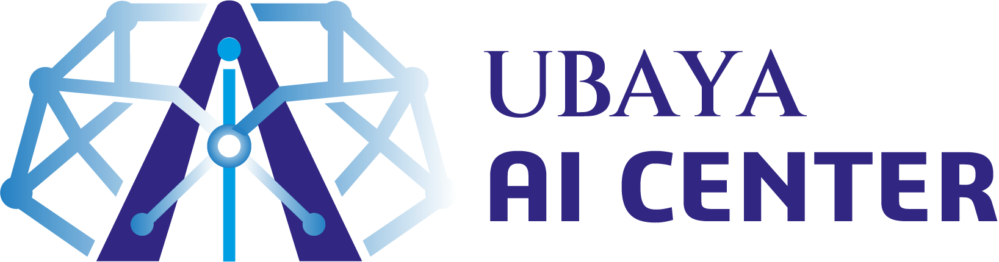

<p align="center">
  
</p>

# YOLO Object Detection Web App

A web app from **Ubaya AI Center** for detecting objects in an uploaded video or
live from a webcam, powered by Ultralytics **YOLO26** and **YOLO12** with
pretrained COCO weights. There is no training step — the checkpoint is
downloaded automatically the first time you select a model.

- **Upload a video** → annotated MP4 with boxes and labels, played back in the page and downloadable.
- **Live webcam** → frames stream to the server over a websocket, boxes are drawn on a canvas overlay in real time.
- **Choose the model** — YOLO26 or YOLO12, in five sizes each (n / s / m / l / x) — plus confidence, IoU, inference size, frame stride, class filter, and optional ByteTrack object IDs.
- Uses NVIDIA CUDA or Apple GPU (MPS) automatically, falls back to CPU.

---

## Requirements

| | Minimum |
|---|---|
| Python | 3.9 – 3.12 (3.11 recommended) |
| Disk | ~3 GB (PyTorch + weights) |
| Internet | needed once, to download PyTorch and the YOLO12 checkpoints |
| Browser | Chrome, Edge, Firefox or Safari (recent) |

ffmpeg is **optional** — only used as a fallback if OpenCV cannot write H.264 on
your machine.

---

## Install on Windows

1. **Install Python.** Download Python 3.11 from
   <https://www.python.org/downloads/windows/> and, in the installer, tick
   **“Add python.exe to PATH”**. Verify in PowerShell:

   ```powershell
   py -3 --version
   ```

2. **Get the project** — download the ZIP and extract it, or:

   ```powershell
   git clone <repo-url> object-detection-app
   cd object-detection-app
   ```

3. **Run it.** Double-click `run.bat`, or from PowerShell:

   ```powershell
   .\run.bat
   ```

   The first run creates `.venv` and installs everything (a few minutes — PyTorch
   is a large download). Then open <http://127.0.0.1:8000>.

### Manual steps (equivalent to `run.bat`)

```powershell
py -3 -m venv .venv
.\.venv\Scripts\Activate.ps1
python -m pip install --upgrade pip
pip install -r requirements.txt
python -m uvicorn backend.app:app --host 127.0.0.1 --port 8000
```

> If PowerShell blocks `Activate.ps1`, run
> `Set-ExecutionPolicy -Scope Process -ExecutionPolicy Bypass` in that window, or
> just use `.venv\Scripts\python.exe -m uvicorn ...` without activating.

### NVIDIA GPU (optional, much faster)

The default install is CPU-only on Windows. With an NVIDIA card and up-to-date
drivers, replace torch afterwards:

```powershell
.\.venv\Scripts\pip.exe uninstall -y torch torchvision
.\.venv\Scripts\pip.exe install torch torchvision --index-url https://download.pytorch.org/whl/cu124
```

Restart the app — the header badge should read `CUDA:0`.

---

## Install on macOS

1. **Install Python** (skip if `python3 --version` already prints 3.9+):

   ```bash
   brew install python
   ```

   No Homebrew? Get it from <https://brew.sh>, or download Python from
   <https://www.python.org/downloads/macos/>.

2. **Get the project**:

   ```bash
   git clone <repo-url> object-detection-app
   cd object-detection-app
   ```

3. **Run it**:

   ```bash
   ./run.sh
   ```

   First run creates `.venv` and installs the dependencies, then serves on
   <http://127.0.0.1:8000>. On Apple Silicon the header badge shows
   **Apple GPU (MPS)** and YOLO12n reaches roughly 30 fps live.

### Manual steps (equivalent to `run.sh`)

```bash
python3 -m venv .venv
./.venv/bin/pip install --upgrade pip
./.venv/bin/pip install -r requirements.txt
./.venv/bin/uvicorn backend.app:app --host 127.0.0.1 --port 8000
```

macOS asks for camera permission the first time you press *Start camera*; if you
denied it, re-enable it under **System Settings → Privacy & Security → Camera**.

---

## Using the app

**Upload tab** — drop a video (MP4/MOV/AVI/MKV/WEBM, up to 512 MB), press
*Run detection*, and watch the progress bar (frames done, processing fps, ETA;
*Cancel* stops it). When it finishes, the annotated video plays in the page with
a *Download result* button and per-class detection counts.

**Live webcam tab** — press *Start camera* and allow camera access. Frames are
captured at 640 px wide, JPEG-encoded, and sent over `/ws/detect`; exactly one
frame is in flight at a time, so the loop self-paces to whatever the model can
do. Settings apply immediately, with no restart.

> The webcam needs a secure context: `http://localhost` / `http://127.0.0.1`
> works, a plain-HTTP LAN address does not. To use it from another machine, put
> the app behind HTTPS.

### Models

Both families are pretrained on COCO (80 classes) and selectable from the
sidebar. **YOLO26** is the newer generation: it predicts end-to-end (NMS-free),
so it is faster at the same size and the IoU/NMS slider does not apply — the app
greys it out automatically when a YOLO26 model is selected.

| Model | Params | mAP<sup>50-95</sup> | Notes |
|-------|--------|------|-------|
| yolo26n | 2.4M | 40.9 | fastest overall, best for live webcam |
| yolo26s | 9.5M | 48.6 | balanced |
| yolo26m | 20.4M | 53.1 | slower on CPU |
| yolo26l | 24.8M | 55.0 | GPU recommended |
| yolo26x | 55.7M | 57.5 | most accurate, slowest |
| yolo12n | 2.6M | 40.6 | fastest YOLO12 |
| yolo12s | 9.3M | 48.0 | balanced |
| yolo12m | 20.2M | 52.5 | slower on CPU |
| yolo12l | 26.4M | 53.7 | GPU recommended |
| yolo12x | 59.1M | 55.2 | most accurate in YOLO12 |

Measured on this project's test clip (Apple M-series, MPS, 640 px): yolo26n
processed video at **25 fps** versus **14 fps** for yolo12n, and ~23 ms versus
~31 ms per webcam frame.

The default on load is `yolo12n`; change `DEFAULT_MODEL_ID` in
[backend/config.py](backend/config.py) to start on a different one, or open the
app with `?model=yolo26n` to preselect it.

Weights are stored in `models/`. *Download / warm up model* in the sidebar
fetches and pre-loads one so the first frame isn't slow.

---

## Project layout

```
backend/
  app.py        FastAPI routes + /ws/detect websocket
  detector.py   model cache, device pick, box drawing
  video.py      background job: decode -> detect -> annotate -> encode
  config.py     paths, model catalog, shared colour palette
static/         index.html, style.css, app.js, logo.png (no build step, no CDN)
models/         downloaded .pt checkpoints
storage/        uploads (deleted after processing) and rendered outputs
run.sh          launcher for macOS / Linux
run.bat         launcher for Windows
```

## API

| Method | Path | Purpose |
|--------|------|---------|
| GET | `/api/meta` | models, device, class list, palette |
| POST | `/api/models/{id}/prepare` | download + warm up a checkpoint |
| POST | `/api/jobs` | multipart upload → starts a detection job |
| GET | `/api/jobs/{id}` | status, progress, ETA, class counts |
| POST | `/api/jobs/{id}/cancel` | stop a running job |
| DELETE | `/api/jobs/{id}` | drop the job and its files |
| GET | `/api/jobs/{id}/video` | annotated MP4 (supports Range/seeking) |
| GET | `/api/jobs/{id}/download` | same file as an attachment |
| WS | `/ws/detect` | send `{"type":"config",…}` then JPEG frames, receive detections |

## Troubleshooting

| Symptom | Fix |
|---|---|
| `Port 8000 is already in use` | start on another port: `PORT=8090 ./run.sh` (macOS) or `set PORT=8090 && run.bat` (Windows) |
| Camera button does nothing | open the app via `localhost`, not a LAN IP; check the browser's camera permission |
| First detection is slow | the checkpoint is downloading — use *Download / warm up model* once |
| “Could not read this video file” | the codec isn't supported by OpenCV; re-save as MP4 (H.264) and retry |
| Very slow on CPU | pick **yolo26n**, inference size 320–480, and “detect every 2nd/3rd frame” |
| IoU slider greyed out | expected on YOLO26 — it is NMS-free, so there is no NMS threshold to set |
| Model download blocked | corporate firewall; download the `.pt` from the Ultralytics GitHub releases and drop it in `models/` |

## Notes

- Output is written as H.264 (`avc1`) when OpenCV supports it; otherwise it falls
  back to `mp4v` and re-encodes with ffmpeg if ffmpeg is on PATH.
- Jobs live in memory, so restarting the server forgets them (rendered files stay
  in `storage/outputs`).
- Env overrides: `ODA_MODELS_DIR`, `ODA_UPLOAD_DIR`, `ODA_OUTPUT_DIR`,
  `ODA_MAX_UPLOAD_MB`, plus `HOST` / `PORT` for the launchers.

---

<sub>Built for Ubaya AI Center · detection by [Ultralytics YOLO26](https://docs.ultralytics.com/models/yolo26/) / [YOLO12](https://docs.ultralytics.com/models/yolo12/)</sub>
